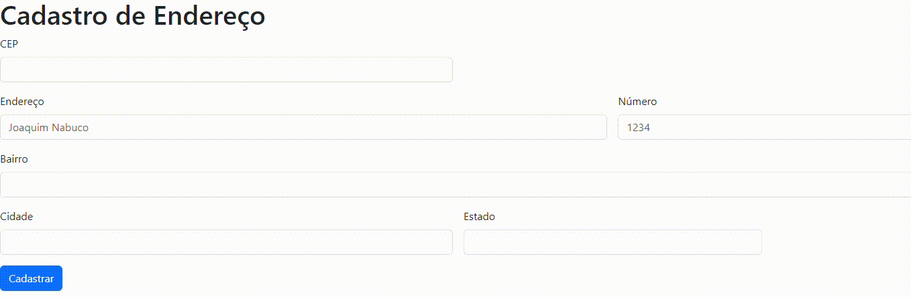

# Cadastro de Endereço

## 📋Descrição
A página de cadastro de endereço é um projeto desenvolvido em linguagem HTML e JavaScript, utilizando as bibliotecas Bootstrap e expressões regulares para a simplificação do código. A página conta com um formulário responsivo, com campos de texto, de números e opções seletivas. Também estamos praticando a melhoria de escrita para fazer um bom README para a disciplina de programação Web I do professor Leonardo Rocha.
O trabalho foi feito em conjunto entre o professor e os alunos para desenvolver um html responsivo, sendo assim uma tela que se adapta ao dispositivo utilizado, também em conjunto fizemos a parte de javascript para a limpeza do formulário, a virificação de CEP, preenchimento de campos, a função para o consumo de API ultilizando a função do tipo assincrona e um adicionamento de um evento DOM, no input CEP.

## 🚀 Começando

## 🔧 Funcionalidades
- `CEP`: Campo para o usuário cadastrar o CEP.
- `Endereço`: Campo para o usuário cadastrar seu endereço.
- `Número`: Campo para o usúario cadastrar o número da sua residência.
- `Bairro`: Campo para o usuário cadastrar seu bairro.
- `Cidade`: Campo para o usuário cadastrar sua cidade.
- `Estado`: Campo para o usúario cadastrar seu estado.
- `Cadastrar`: Botão para salvar os dados inseridos nos campos.
- `Preenchimento automático`: Quando inserido o CEP os campos `Endereço` e `Bairro` são preenchidos automáticamente.
- `Verifica se o CEP é válido`: Quando inserido o CEP, ele verifica se é válido.

### 🛠️ Tecnologia ultilizadas
  | |   |   | |
| :---: | :---: | :---: | :---: | :---: |

## 📄 Fontes consultadas
- [Como criar um README para o seu perfil do GitHub](https://www.alura.com.br/artigos/como-criar-um-readme-para-seu-perfil-github) 
- [Um modelo para fazer um bom README.md](https://gist.github.com/lohhans/f8da0b147550df3f96914d3797e9fb89)
- [Como fazer um bom README](https://blog.rocketseat.com.br/como-fazer-um-bom-readme/)
- [Como escrever um README incrível no seu Github](https://www.alura.com.br/artigos/escrever-bom-readme)
- [Como escrever um bom arquivo README para seu projeto do GitHub](https://www.freecodecamp.org/portuguese/news/como-escrever-um-bom-arquivo-readme-para-seu-projeto-do-github/)

## ✒️ Autores
| [ Hanelise Naves Amorim](https://github.com/hiseamorim) |  [ Leonardo Rocha](https://github.com/LeonardoRochaMarista) |  [ Marista Escola Social Ir. Acácio](https://github.com/MaristaIrAcacio) | [ Maria Eduarda Simões](https://github.com/Mariaeduardasimoes) |
| :---: | :---: | :---: | :---: |

