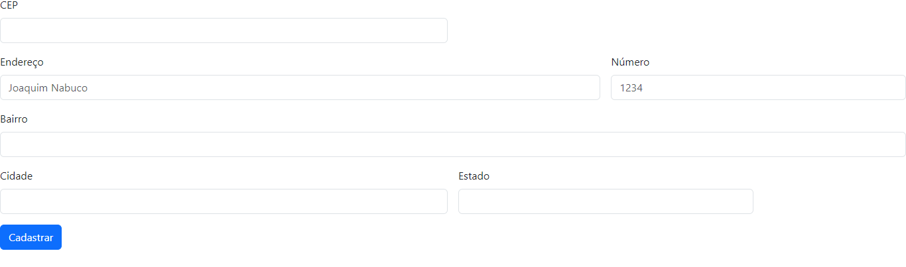

# Cadastro de Endereço

## 📋Descrição
A página de cadastro de endereço é um projeto desenvolvido em linguagem HTML, CSS e JavaScript, utilizando as bibliotecas Bootstrap e expressões regulares para a simplificação do código. A página conta com um formulário responsivo, com campos de texto, de números e opções seletivas. Também estamos praticando a melhoria de escrita para fazer um bom README para a disciplina de programação Web I do professor Leonardo Rocha.

## 🚀 Começando

## 🔧 Funcionalidades
- `CEP`: Campo para o usuário cadastrar o CEP.
- `Endereço`: Campo para o usuário cadastrar seu endereço.
- `Número`: Campo para o usúario cadastrar o número da sua residência.
- `Bairro`: Campo para o usuário cadastrar seu bairro.
- `Cidade`: Campo para o usuário cadastrar sua cidade.
- `Estado`: Campo para o usúario cadastrar seu estado.
- `Cadastrar`: Botão para salvar os dados inseridos nos campos.
- `Preenchimento automático`: Qundo inserido o CEP os campos `Endereço` e `Bairro` são preenchidos automáticamente.

### 🛠️ Tecnologia ultilizadas
  | |   |   | |
| :---: | :---: | :---: | :---: | :---: |

## ✒️ Autores
| [ Hanelise Naves Amorim](https://github.com/hiseamorim) |  [ Leonardo Rocha](https://github.com/LeonardoRochaMarista) |  [ Marista Escola Social Ir. Acácio](https://github.com/MaristaIrAcacio) |
| :---: | :---: | :---: |

